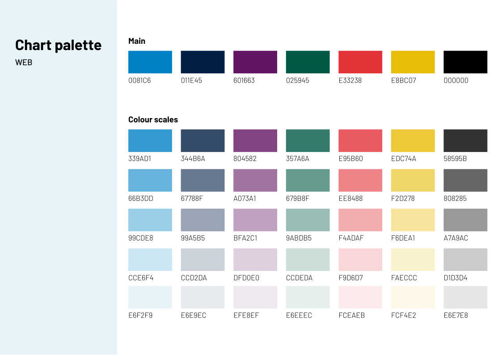
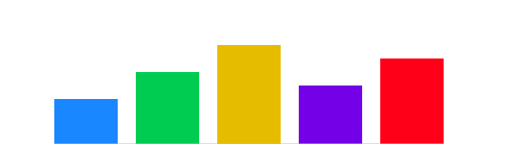

# Colour Palettes

We standardise three palette types — **categorical**, **sequential**, and **diverging** — with Business News brand colours.

## Brand colours (print CMYK → web HEX)

<em>Click the palette to download the SVG file</em>

  

    

    
<strong>BN Blue</strong> CMYK 90/47/0/0 → <code>#1987FF</code>

  

  

    

    
<strong>Dark Blue</strong> CMYK 100/60/0/40 → <code>#003D99</code>

  

  

    

    
<strong>Green</strong> CMYK 100/0/60/20 → <code>#00CC52</code>

  

  

    

    
<strong>Red</strong> CMYK 0/100/90/0 → <code>#FF0019</code>

  

  

    

    
<strong>Gold</strong> CMYK 0/18/100/10 → <code>#E6BC00</code>

  

  

    

    
<strong>Purple</strong> CMYK 50/100/0/10 → <code>#7300E6</code>

  

!!! note
    CMYK values come from the publication style guide. Web HEX approximations are calculated from CMYK. If brand provides official RGB/HEX, prefer those.

---

## Categorical (Qualitative)
Use for **distinct, unordered** categories. Limit to **≤10** colours; group small categories as “Other”. Ensure hue separation and sufficient contrast.

**Default order:** BN Blue → Green → Gold → Purple → Red → Neutral grey.

---

## Sequential
Use for **ordered/numeric** data. Encode magnitude with lightness in a **single-hue ramp**.

**BN Blue ramp examples:** `#D6E4F0 → #97BBD6 → #4F87B6 → #003865`

---

## Diverging
Use when data vary around a meaningful **midpoint** (0, average, target). Two hue ramps meet at a neutral centre.

**Default diverging:** Red ramp (negative) ↔ Neutral grey ↔ Blue ramp (positive).

!!! tip
    Never rely on colour alone. Pair with direct labels or markers. Check WCAG contrast (AA) for text on fills.
